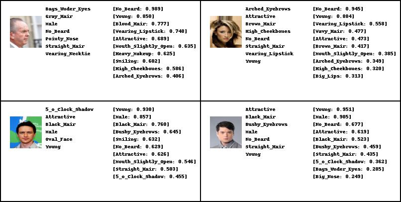
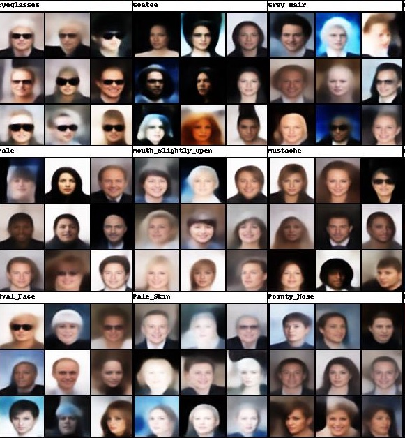

# SCAN
Pytorch reproduction of the paper:
[SCAN: Learning Hierarchical Compositional Visual Concepts, Higgins et al., ICLR 2018]

This implementation is based on the [implementation][Github Repo] of β-VAE.
The β-VAE model used here, however, is modified to utilize another DAE as reconstruction loss provider according to the paper.

### Dependencies
```
python 3.6.4
pytorch 0.3.1.post2
visdom
numpy
```

### Datasets
[same with here]

### Usage
To initialize visdom:

    ```
    vidsom -port 6059
    ```

To reproduce the results of SCAN, you can sequentially run the three `.sh` files:

    ```
    sh scripts/DAE.sh
    sh scripts/beta_VAE.sh
    sh scripts/SCAN.sh
    ```

By default, the working environment setting is `/data/hc/SCAN/` in `main.py` `--root_dir`, which should be modified for your convenience.
This is directory suppose to contain the dataset in `root_dir/dataset/`, and is where checkpoint files and output files will be saved.
The original β-VAE models are still supported, and examples of result reproducing commands can be found in `scripts/original-beta_VAE/`


### Selected Results

For results in full detail, please refer to the [file](results/Results_in_detail.md) of `results/Results_in_detail.md`.

#### reconstruction


#### img2sym



#### sym2img



#### traversal


### Acknowledgement:

I've referred to [this issue][], and adopted its solution which is to use the DAE output rather than to improve the visuality of β-VAE.

### Notice

There is some sort of self-contradiction in the paper.

1. The reconstruction loss of β-VAE is said to be the square difference of only the DAE encoder net in its Section 4, but in Appendix A.1 the loss is said to be between "the pixel space of DAE reconstructions".
This is mentioned in the [issue][this issue] above, too.
In the code, I applied only the encoder net.

2. Under equation(4) of the paper, the authors mentioned "to up-weight the forward KL term relative to the other terms in the cost function (e.g. λ = 1, β = 10)", which seems to be self-contradicting.
In the code, I adopted the setting in Appendix A.1, which is λ = 10, β = 1


### Reference
1. [SCAN: Learning Hierarchical Compositional Visual Concepts, Higgins et al., ICLR 2018]
2. [Github Repo]: Pytorch implementation of β-VAE from [1Konny](https://github.com/1Konny)

[SCAN: Learning Hierarchical Compositional Visual Concepts, Higgins et al., ICLR 2018]: https://arxiv.org/abs/1707.03389
[Github Repo]: https://github.com/1Konny/Beta-VAE 
[same with here]: https://github.com/1Konny/FactorVAE 
[this issue]: https://github.com/miyosuda/scan/issues/1
