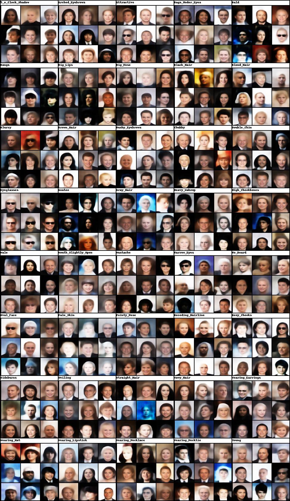
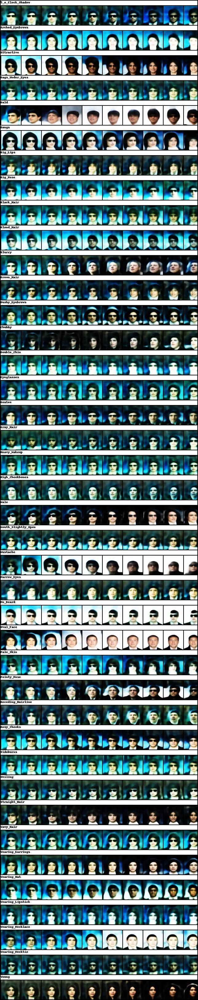

## SCAN Results

#### reconstruction

#### img2sym

#### sym2img

#### traverse

Unfortunately, the convergence of SCAN is not conspicuous in plots of the losses, compared to the more obvious convergence of DAE and beta-VAE models.

#### reconstruction loss

#### forward KL term

#### KL divergence

## DAE Results

#### reconstruction

#### reconstruction loss

## Beta-VAE Results

#### reconstruction
